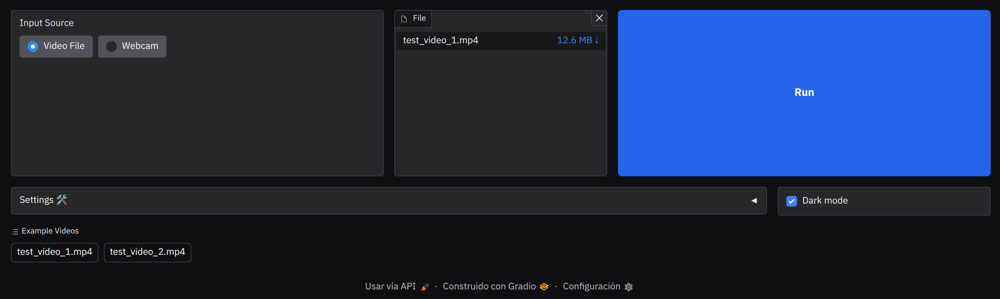

# License Plate Detection System with YOLO and OCR

This project is a system for detecting vehicle license plates from video or real-time camera input. It uses a YOLO model for detecting license plates and EasyOCR for recognizing the characters. Additionally, it employs the DeepSORT library for object tracking throughout the video.


## Features

- Detect license plates in video files or live webcam
- Track multiple vehicles and their plates across frames
- Recognize plate text using OCR with confidence filtering
- Visualize tracker IDs, object trajectories, and FPS
- Save processed video with overlays
- Interactive Gradio web UI for easy use and configuration
- Clean Python package structure with proper dependency management

---

## Project Structure

```
license-plate-detector/
├── src/
│   ├── __init__.py         # Package definition
│   ├── app.py              # Main entry point
│   ├── config.py           # Configuration variables
│   ├── detection/          # YOLO detector logic
│   │   ├── __init__.py
│   │   └── yolo.py
│   ├── ocr/                # OCR utilities
│   │   ├── __init__.py
│   │   └── ocr.py
│   ├── tracking/           # DeepSORT tracker
│   │   ├── __init__.py
│   │   └── tracker.py
│   ├── ui/                 # User interface components
│   │   ├── __init__.py
│   │   ├── gradio_ui.py    # Gradio web interface
│   │   ├── drawing.py      # Drawing overlays
│   │   └── interface.py    # Video overlay helpers
│   ├── video/              # Video capture and saving
│   │   ├── __init__.py
│   │   └── video_handler.py
│   └── utils/              # Utility functions
│       ├── __init__.py
│       └── logger.py
├── setup.py               # Package installation script
├── Makefile               # Development task automation
├── requirements.txt       # Runtime dependencies
├── requirements-dev.txt   # Development dependencies
├── media/                 # Media assets
└── README.md              # This file
```

---

## Installation

### Prerequisites
- Python 3.11 or higher
- pip (Python package manager)
- make (for development tasks)

### Minimal installation
The following commands creates a virtual environment and installs the package dependencies for running the application.
```bash
make install
```

### Development installation
Run the following command, that installs the required packages for running the application and also for development tasks (such as building documentation, executing tests or building packages)
```bash
make install-dev
```

---

## Configuration

Edit `src/config.py` to customize behavior:

- `INPUT_VIDEO`: Path to video file to process (`'./data/test_video_2.mp4'` by default)
- `WEBCAM`: Use webcam (`True`) or video file (`False`)
- `SAVE_TO_VIDEO`: Save processed video when using a file
- `SHOW_TRACKER_ID`: Show tracker ID with plate
- `SHOW_FPS`: Show FPS counter
- `SHOW_TRAJECTORY`: Show tracked object trajectories
- `TRAJECTORY_LENGTH`: Max length of trajectory line
- `MODEL_PATH`: Path to YOLO model (`.pt` for PyTorch or NCNN format)
- `YOLO_THRESHOLD`: Detection confidence threshold (default: `0.5`)
- `OCR_CONFIDENCE_THRESHOLD`: Minimum confidence for OCR results (default: `0.02`)
- `COSINE_DISTANCE_THRESHOLD`: Cosine distance threshold for re-identification (default: `0.4`)
- `N_INIT`: Number of detections to confirm a track (default: `10`)
- `MAX_AGE`: Max frames before a track is deleted (default: `60`)
- `STOP_REQUESTED`: Set by UI to interrupt processing

---

## Usage
To run the app, execute:

```bash
make run
```

- By default, the Gradio web UI will launch at http://localhost:7860
- You can select video file or webcam, and adjust all settings in the UI

---

## User Interface

The Gradio UI provides an easy way to upload/select video, switch between webcam and file, and adjust all detection/tracking parameters interactively.



---

## Video resources
The video resources used in this project are:

| Asset | Details |
|-------|---------|
| test_video_1.mp4 | **Author:** Manuel Mata Gallego  <br> **Source:** [Vecteezy](https://es.vecteezy.com/video/36990287-trafico-carros-paso-en-la-carretera-con-asfalto-con-grietas-visto-desde-encima)  <br> **License:** Vecteezy Free License – attribution required.  <br> Stock footage by Vecteezy.com |
| test_video_2.mp4 | **Author:** Mike Bird  <br> **Source:** [Pexels](https://www.pexels.com/video/traffic-flow-in-the-highway-2103099/)  <br> **License:** Pexels License – attribution is not mandatory but appreciated.  <br> Stock footage by Mike Bird via Pexels.com |

---

## Detection Model
The detection model used is based on YOLOv8 and is trained on a custom dataset of license plates. The model and its training code is available at https://github.com/marcoom/yolo-licence-plate-training

---

## Documentation

HTML and PDF documentation is generated with Sphinx. To build docs:

```bash
make docs
```
The documentation is generated inside the /docs/build directory.

More Make commands are available to generate only html (make docs-html), pdf (make docs-pdf) or remove documentation building files (make docs-clean).


---

## Building Distributions

To see all available make commands and their descriptions, run:

```bash
make help
```

To build source and wheel distributions for the package:

```bash
# Build source and wheel distributions
make dist

# Clean build artifacts
make clean
```

This will create both a source distribution (`.tar.gz`) and a wheel (`.whl`) in the `dist/` directory. The distributions will include all necessary files specified in `setup.py`.

To install the built wheel:

```bash
pip install dist/*.whl
```

Or install directly from the source distribution:

```bash
pip install dist/*.tar.gz
```

---

## License

This project is licensed under the GNU Affero General Public License v3.0 (AGPL-3.0).

By using, modifying, or distributing this software, you agree to the terms of the AGPL-3.0 license. If you deploy this software as a service (e.g., over a network), you must make the complete source code of the running version available to users. See the LICENSE file for details.

Third-party components are used under their respective licenses. See the NOTICE file for attributions and more information.

---

## Attribution

Third-party components are used under their respective licenses. See the `NOTICE` file for more information.
